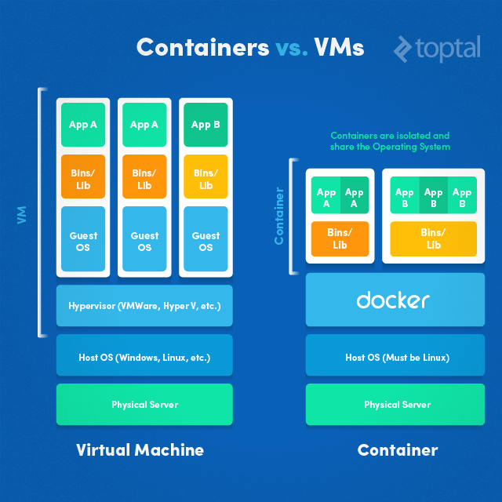

# Docker and DevOps

- [Docker and DevOps](#Docker-and-DevOps)
  - [Introduction](#Introduction)
  - [Preamble](#Preamble)
    - [What is DevOps?](#What-is-DevOps)
  - [Containerization](#Containerization)
  - [Docker and its role in DevOps](#Docker-and-its-role-in-DevOps)
  - [Containerization in Docker](#Containerization-in-Docker)
    - [The Dockerfile](#The-Dockerfile)
  - [_"But it works in my computer"_](#%22But-it-works-in-my-computer%22)
  - [Adoption](#Adoption)
  - [Advantages](#Advantages)
  - [Thanks and stuff](#Thanks-and-stuff)

## Introduction

- [Me, myself and just me](https://rajshrimohanks.me/)  
- [IQZ Systems](https://iqzsystems.com)
- What do I do
- What this talk is going to be about

## Preamble


- What made this possible?

### What is DevOps?

>>> DevOps is a set of practices that automates the processes between software development and IT teams, in order that they can build, test, and release software faster and more reliably. - [_Atlassian_](https://www.atlassian.com/devops)

>>> DevOps is a set of software development practices that combine software development (Dev) and information technology operations (Ops) to shorten the systems development life cycle while delivering features, fixes, and updates frequently in close alignment with business objectives. - [_Wikipedia_](https://en.wikipedia.org/wiki/DevOps)

- Traditional manual approach and its pitfalls
- Continuous Integration & Continuous Deployment
- Infrastructure as Code

## Containerization

- Shipping Containers - why they happened
- Container Engine
  - Is Docker the only container engine? (rkt?)
- Why isolate?
- Difference between VM and container


(Image courtesy: [_TopTal_](https://www.toptal.com/devops/getting-started-with-docker-simplifying-devops))

## Docker and its role in DevOps

- _Build once, deploy anywhere_

## Containerization in Docker

- The Dockerfile
- Filesystem isolation
  - Volumes
- Network isolation

### The Dockerfile

- Defines how a container should be built
- An example
  
```Dockerfile
# Set the base image to node
FROM node:10.16.0

# Add metadata
LABEL maintainer.name="Rajshri Mohan K S" \
  maintainer.email="rajshri.m@iqzsystems.com"

# Change shell from sh to bash
SHELL ["/bin/bash", "-c"]

# Set environment variables
ENV WORK_DIR /app/

# Get app port
ARG PORT

# Set Working Directory
WORKDIR $WORK_DIR

# Set up app
COPY package*.json $WORK_DIR
RUN npm install
COPY . $WORK_DIR
RUN npm run build

# Expose port
EXPOSE $PORT

CMD ["node","./dist/main.js"]
```

- Caching and Layers
- [A more complex example](./examples/Dockerfile)

## _"But it works in my computer"_

-  The problem
-  How Docker solves this
-  Platform agnostistic deployments
   -  Windows, Linux, etc.
-  Advantages for developers, testers and business

## Adoption

- Cloud providers
  - AWS
  - Azure
  - Google
- Deployment tools
  - Jenkins
  - GitLab
- Kubernetes

## Advantages

- How Docker enables CI and CD

## Thanks and stuff

- IQZ is hiring creative people
- Contact me